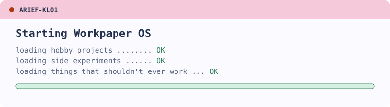

  

# Hi, I'm Arief 👋

I build automation and small tools in Python and JavaScript, mostly because I can't leave a repetitive task alone. Based in Selangor, Malaysia.

🔭 **My portfolio:** [ariefs-portfolio.vercel.app](https://ariefs-portfolio.vercel.app/), a pastel desktop you can log on to, with a 3D badge and a little accounting game hiding inside.

## Toolbox

## Modding and reverse engineering

- **Godot mods:** unpack exported games, read the scripts, patch them and ship an in-game F1 mod menu with infinite resources and similar cheats
- **Unreal Engine mods:** Lua scripts through UE4SS that hook into a game's reflection data to adjust gauges and stats in *Dragon Ball Sparking! ZERO*
- **Baldur's Gate 3:** custom weapon mod
- **Save editors:** a cross-platform Go/Fyne editor with binary parsing and encryption handling, and an Android one built on an IL2CPP dump and adb

## Automation and tools

- **Game bot:** drives an Android emulator over ADB, finds buttons with OpenCV template matching and recovers from screens it doesn't expect
- **Realtime screen translator:** reads text off the screen and translates it as you play
- **WhatsApp sticker maker:** converts images and clips into stickers
- **Draft helper** for a mobile MOBA

## Say hello

[LinkedIn](https://www.linkedin.com/in/ahmad-arief) · [Email](mailto:ahmadarief4701@gmail.com)
